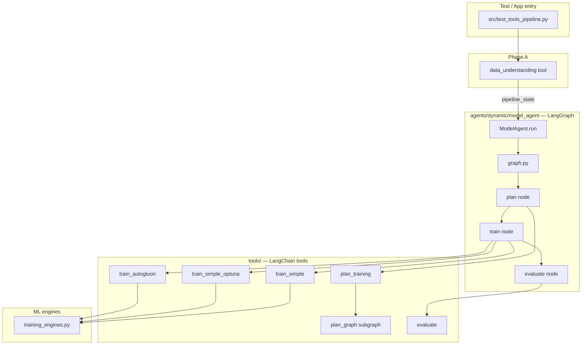

# Model Agent & Training Pipeline — Full Documentation

> **Per-file reference:** see [`MODEL_AGENT_FILES.md`](./MODEL_AGENT_FILES.md) for a detailed explanation of every ModelAgent, tool, helper, and engine file.

This document explains the **training agent architecture** in this repo: what was built, how it fits together, what every file does, and how it matches the intended design (**one LangGraph agent that calls training tools** — no duplicated training logic inside the agent).

---

## 1. Did we follow your requested structure?

**Yes — with this separation:**

| Layer                     | Location                          | Responsibility                                     |
| ------------------------- | --------------------------------- | -------------------------------------------------- |
| **Agent (orchestration)** | `agents/dynamic/model_agent/`     | LangGraph workflow only: **call tools in order**   |
| **Tools (execution)**     | `tools/`                          | LangChain `@tool` functions: plan, train, evaluate |
| **Engines (ML logic)**    | `tools/nodes/training_engines.py` | Actual sklearn / Optuna / AutoGluon / Dask code    |

The **ModelAgent does not train models itself**. Each graph node looks up a tool from `ToolRegistry` and calls `tool.invoke(...)`. Training math lives in `tools/`, not in `agents/dynamic/model_agent/`.

```
┌─────────────────────────────────────────────────────────────┐
│  ModelAgent (LangGraph)                                      │
│    plan node  ──invoke──►  plan_training tool                │
│    train node ──invoke──►  train_simple | optuna | autogluon │
│    eval node  ──invoke──►  evaluate tool                     │
└─────────────────────────────────────────────────────────────┘
                              │
                              ▼
┌─────────────────────────────────────────────────────────────┐
│  tools/nodes/training_engines.py  (sklearn, Optuna, AG, …)   │
└─────────────────────────────────────────────────────────────┘
```

**Not the same as legacy `AutoMLAgent`** (`agents/automl_agent/`) — that is a large monolithic LangGraph still used by `orchestrator.py` and OpenML benchmarks. The new path uses **ModelAgent + tools**.

**Entry point for training:** `agents/dynamic/model_agent/model_agent.py` → class `ModelAgent`.

---

## 2. End-to-end flow (what happens when you run the pipeline)

Typical command:

```bash
source automl_env_310/bin/activate
python src/test_tools_pipeline.py --mode model_agent --data iris
```

### Phase A — EDA (optional, before ModelAgent)

| Step | Who                       | What                                                                                                         |
| ---- | ------------------------- | ------------------------------------------------------------------------------------------------------------ |
| 1    | `data_understanding` tool | Reads CSV, sends compact profile + user prompt to LLM, saves `eda_report.json`, sets `pipeline_state.report` |

### Phase B — ModelAgent (LangGraph)

| Step | Graph node | Tool called                                                          | What happens                                                                 |
| ---- | ---------- | -------------------------------------------------------------------- | ---------------------------------------------------------------------------- |
| 2    | `plan`     | `plan_training`                                                      | Inner plan graph: identify target → LLM model selection → user approves plan |
| 3    | `train`    | `train_simple` **or** `train_simple_optuna` **or** `train_autogluon` | From `training_plan.train_tool`                                              |
| 4    | `evaluate` | `evaluate`                                                           | Returns metrics already computed at train time                               |

### Shared state

All tools read/write **`pipeline_state`** (`tools/pipeline_state.py`): EDA report, `training_plan`, `model_metrics`, paths, step name.



---

## 3. ModelAgent files (`agents/dynamic/model_agent/`)

Strict LangGraph layout: **state → graph → nodes → agent class**.

| File                    | Role                                                                                                                                                      |
| ----------------------- | --------------------------------------------------------------------------------------------------------------------------------------------------------- |
| **`model_agent.py`**    | Public API. `ModelAgent.run(data_path, prompt, pipeline_state, ...)` builds graph, invokes it, returns final `pipeline_state`.                            |
| **`graph.py`**          | `build_model_graph(llm, registry, config)` — compiles LangGraph: `plan → train → evaluate` with conditional edges (stop if plan rejected or train fails). |
| **`state.py`**          | `ModelAgentState` TypedDict: `data_path`, `prompt`, `pipeline_state`, `last_tool`, `last_result`, `error`, `step`.                                        |
| **`tool_runner.py`**    | Thin helper: `invoke_tool(tool, task, tool_input, prompt, data_path, llm, pipeline_state)` — standard LangChain tool signature.                           |
| **`nodes/plan.py`**     | Graph node factory `make_plan_node` → gets `plan_training` from registry → invokes it.                                                                    |
| **`nodes/train.py`**    | Graph node factory `make_train_node` → reads `training_plan.train_tool` → invokes the matching train tool.                                                |
| **`nodes/evaluate.py`** | Graph node factory `make_evaluate_node` → invokes `evaluate` tool.                                                                                        |
| **`__init__.py`**       | Exports `ModelAgent`, `build_model_graph`, `ModelAgentState`.                                                                                             |

**Important:** Nodes are **adapters** (~50 lines each). They do not contain ML code.

### Conditional routing (`graph.py`)

| After      | Condition                                          | Next       |
| ---------- | -------------------------------------------------- | ---------- |
| `plan`     | `status == "planned"` and `training_plan.approved` | `train`    |
| `plan`     | rejected / error                                   | `END`      |
| `train`    | `status == "success"`                              | `evaluate` |
| `train`    | error                                              | `END`      |
| `evaluate` | always                                             | `END`      |

---

## 4. Training tools (`tools/`)

Each training path is its **own tool file** (as requested). All use `training_common.py` and `training_engines.py`.

### 4.1 Planning

| File                           | Tool name       | Purpose                                                                                                                                       |
| ------------------------------ | --------------- | --------------------------------------------------------------------------------------------------------------------------------------------- |
| **`plan_training.py`**         | `plan_training` | Main planning tool: user prompts (target, models, time, approval), runs plan subgraph, builds `training_plan`, gates training until approved. |
| **`plan_graph.py`**            | (subgraph)      | LangGraph: `identify_target` → `model_selection`. Used **inside** `plan_training`, not by ModelAgent directly.                                |
| **`graph_state.py`**           | —               | `TrainingGraphState` for plan subgraph.                                                                                                       |
| **`nodes/identify_target.py`** | —               | Sets `target_column` and `problem_type` (classification/regression).                                                                          |
| **`nodes/model_selection.py`** | —               | **LLM call**: picks one of 3 approaches + models + Optuna search space or AutoGluon preset from **data profile + user prompt**.               |

### 4.2 Training (three options only)

| File                         | Tool                  | When used                       | Engine function                               |
| ---------------------------- | --------------------- | ------------------------------- | --------------------------------------------- |
| **`train_simple.py`**        | `train_simple`        | Plan approach = `simple`        | `train_simple_defaults`                       |
| **`train_simple_optuna.py`** | `train_simple_optuna` | Plan approach = `simple_optuna` | `train_simple_optuna` (+ LLM `optuna_config`) |
| **`train_autogluon.py`**     | `train_autogluon`     | Plan approach = `autogluon`     | `train_autogluon` (+ LLM `automl_config`)     |

### 4.3 Evaluation & support

| File                            | Purpose                                                                                 |
| ------------------------------- | --------------------------------------------------------------------------------------- |
| **`evaluate.py`**               | Reads `pipeline_state.model_metrics` (metrics computed during training).                |
| **`training_common.py`**        | Load preprocessed splits, plan graph bridge, plan approval, metrics, save `model.pkl`.  |
| **`nodes/training_engines.py`** | Core ML: sklearn defaults, Optuna HPO (with LLM search space), AutoGluon, Dask-XGBoost. |
| **`pipeline_state.py`**         | `empty_state`, `merge_state`, `ensure_state` — shared dict between agent and tools.     |
| **`registry.py`**               | `ToolRegistry` — register/get tools for ModelAgent and ControllerAgent.                 |

### 4.4 EDA & stubs

| File                         | Status                                                                      |
| ---------------------------- | --------------------------------------------------------------------------- |
| **`data_understanding.py`**  | Active — EDA before training; compact LLM prompt; respects user `--prompt`. |
| **`data_cleaning.py`**       | Stub — only updates step, no logic.                                         |
| **`feature_engineering.py`** | Stub — only updates step, no logic.                                         |

### 4.5 Removed

| File                          | Reason                     |
| ----------------------------- | -------------------------- |
| ~~`tools/model_training.py`~~ | Deprecated alias; deleted. |

---

## 5. The three training approaches (LLM + code)

The LLM **must** choose exactly one (enforced in `model_selection.py`):

| LLM `approach`  | `training_plan.approach` | Tool                  | What it does                                                             |
| --------------- | ------------------------ | --------------------- | ------------------------------------------------------------------------ |
| `Simple`        | `simple`                 | `train_simple`        | sklearn, default hyperparameters                                         |
| `Simple+Optuna` | `simple_optuna`          | `train_simple_optuna` | sklearn + Optuna; uses LLM `optuna_config` (trials + search space)       |
| `AutoGluon`     | `autogluon`              | `train_autogluon`     | AutoGluon tabular; uses LLM `automl_config` (preset, models, time limit) |

**Dask-XGBoost** is **not** an LLM choice. If rows > **700,000**, train tools automatically use Dask regardless of approach.

### LLM inputs for model selection

1. **DATA PROFILE** — rows, cols, dtypes, 3 sample rows, target stats, short EDA summary
2. **USER PROMPT** — `--prompt`, interactive training note, time/HW/model prefs (if any)
3. **ALLOWED OPTIONS** — whitelists for models, presets, Optuna param catalog (prevents hallucination)

### LLM outputs (parsed and validated)

**Simple / Simple+Optuna:**

```json
{
  "approach": "Simple+Optuna",
  "reasoning": "...",
  "simple_models": ["RandomForest", "GradientBoosting"],
  "optuna_settings": {
    "n_trials": 30,
    "search_space": {
      "RandomForest": {
        "n_estimators": { "type": "int", "low": 50, "high": 200 },
        "max_depth": { "type": "int", "low": 3, "high": 15 }
      }
    }
  }
}
```

**AutoGluon:**

```json
{
  "approach": "AutoGluon",
  "reasoning": "...",
  "autogluon_settings": {
    "models_to_prioritize": ["GBM", "XGB"],
    "time_limit_seconds": 180,
    "preset_mode": "good_quality_faster_inference"
  }
}
```

Stored on `training_plan` as `selected_models`, `optuna_config`, `automl_config`.

### User approval

After the plan is printed, the user must confirm (unless `--no-prompts`):

```
Continue with this LLM-suggested training plan? [y/N]:
```

Train tools **refuse** to run if `training_plan.approved != True`.

---

## 6. `training_plan` structure (in `pipeline_state`)

After `plan_training` succeeds:

```python
{
  "approach": "simple_optuna",           # simple | simple_optuna | autogluon
  "training_method": "Simple + Optuna HPO",
  "train_tool": "train_simple_optuna",   # used by ModelAgent train node
  "approved": True,
  "selected_models": ["RandomForest", "GradientBoosting"],
  "optuna_config": {                     # only for simple_optuna
    "n_trials": 30,
    "search_space": { ... }
  },
  "automl_config": { ... },              # only for autogluon
  "reasoning": "<LLM JSON / text>",
  "n_rows": 150,
  "use_dask_training": False,
}
```

After training:

```python
pipeline_state["model_metrics"]  # test_accuracy, confusion_matrix, etc.
pipeline_state["saved_files"]    # path to model.pkl
pipeline_state["step"]           # "evaluated"
```

---

## 7. Metrics (how to read scores)

| Field               | Meaning                                              |
| ------------------- | ---------------------------------------------------- |
| `all_scores`        | Validation score **during** model selection / tuning |
| `tuning_best_score` | Best validation score before hold-out test           |
| `test_accuracy`     | Accuracy on 20% hold-out test set                    |
| `test_f1_score`     | Weighted F1 on test set                              |
| `best_score`        | Same as `test_accuracy` (main reported score)        |
| `confusion_matrix`  | Rows = true class, columns = predicted               |

---

## 8. Entry points & run modes

| Command / file                                    | Role                                                                     |
| ------------------------------------------------- | ------------------------------------------------------------------------ |
| `src/test_tools_pipeline.py --mode model_agent`   | **Recommended** — EDA + ModelAgent                                       |
| `src/test_tools_pipeline.py --mode manual`        | Alias for `model_agent`                                                  |
| `src/test_tools_pipeline.py --mode controller`    | `ControllerAgent` — LLM picks tools one-by-one (different orchestration) |
| `src/test_tools_pipeline.py --mode tool --tool X` | Single tool smoke test                                                   |
| `src/run_dynamic.py`                              | Runs `ControllerAgent` on a fixed dataset                                |
| `setup_mac.sh`                                    | Mac install: venv, deps, sample CSVs                                     |

### Useful flags

```bash
# LLM decides from data + optional prompt
python src/test_tools_pipeline.py --mode model_agent --data iris

# Custom user instructions (fed to EDA + model selection)
python src/test_tools_pipeline.py --mode model_agent --data iris \
  --prompt "Predict species. Prefer sklearn with Optuna."

# Auto-approve plan (no interactive y/N)
python src/test_tools_pipeline.py --mode model_agent --data iris --no-prompts

# Force approach (bypasses LLM approach choice)
python src/test_tools_pipeline.py --mode model_agent --data iris --approach 3
```

### Programmatic use

```python
from agents.dynamic.model_agent import ModelAgent

from tools.pipeline_state import empty_state

# register tools on registry (see src/test_tools_pipeline.py build_registry)
agent = ModelAgent(logger, llm, registry)
state = empty_state(data_path, prompt)
# run data_understanding first if you need EDA in state.report

final_state = agent.run(
    data_path,
    prompt,
    pipeline_state=state,
    ask_before_training=True,
    auto_approve_plan=False,
)
```

---

## 9. How this relates to other agents

| Component           | Path                               | Relationship                                           |
| ------------------- | ---------------------------------- | ------------------------------------------------------ |
| **ModelAgent**      | `agents/dynamic/model_agent/`      | Training orchestrator; **calls tools**                 |
| **ControllerAgent** | `agents/dynamic/controller_agent/` | Full-pipeline LLM loop; also **calls same tools**      |
| **AutoMLAgent**     | `agents/automl_agent/`             | Legacy; **does not** use ModelAgent or tools train\_\* |
| **EDAAgent**        | `agents/eda_agent/`                | Legacy orchestrator EDA                                |
| **Preprocessing**   | `agents/preprocessing_agent/`      | Legacy orchestrator preprocessing                      |

---

## 10. Timeline of what was built (this effort)

1. **Training tools split** — `train_simple`, `train_simple_optuna`, `train_autogluon` + `training_engines.py` (no `AutoMLAgent` import).
2. **`plan_training`** — LangGraph subgraph for target + LLM model selection; user approval gate.
3. **`pipeline_state`** — shared state between controller, ModelAgent, and tools.
4. **Bug fixes** — naming collision in `train_simple_optuna`; multiclass metrics; honest AutoGluon fallback reporting.
5. **`ModelAgent`** — LangGraph agent (`agents/dynamic/model_agent/`) that **only invokes tools**.
6. **Prompt tuning** — token-efficient EDA/model prompts; data profile + user prompt drive decisions; 3 approaches only; whitelisted models/presets; Optuna search space + AutoGluon settings from LLM.
7. **`setup_mac.sh`** + `requirements-mac.txt` — Mac-friendly environment install.
8. **Removed** `tools/model_training.py` (deprecated).

---

## 11. Outputs on disk

| Artifact       | Typical path                                               |
| -------------- | ---------------------------------------------------------- |
| EDA report     | `output/dynamic_pipeline/{timestamp}/eda_report.json`      |
| Trained model  | `output/dynamic_pipeline/{timestamp}/training_*/model.pkl` |
| Test run state | `output/test_pipeline/final_state.json`                    |

---

## 12. Environment variables

| Variable               | Purpose                                   |
| ---------------------- | ----------------------------------------- |
| `GOOGLE_API_KEY`       | Required for LLM (EDA, model selection)   |
| `GEMINI_MODEL`         | Optional, default `gemini-2.5-flash`      |
| `AUTOML_OPTUNA_TRIALS` | Fallback Optuna trials if not set in plan |

---

## 13. Quick reference — “who calls whom?”

```
test_tools_pipeline.py
  └─ data_understanding.invoke()
  └─ ModelAgent.run()
       └─ graph.invoke()
            ├─ plan node → plan_training.invoke()
            │                 └─ plan_graph.invoke()
            │                      ├─ identify_target_node
            │                      └─ model_selection_node (LLM)
            ├─ train node → train_{simple|simple_optuna|autogluon}.invoke()
            │                 └─ training_engines.train_*()
            └─ evaluate node → evaluate.invoke()
```

**That is the structure you asked for:** one training agent (`ModelAgent`) in LangGraph form, which **calls the tools** under `tools/` for every step. Training logic stays in tools/engines; the agent only orchestrates.
