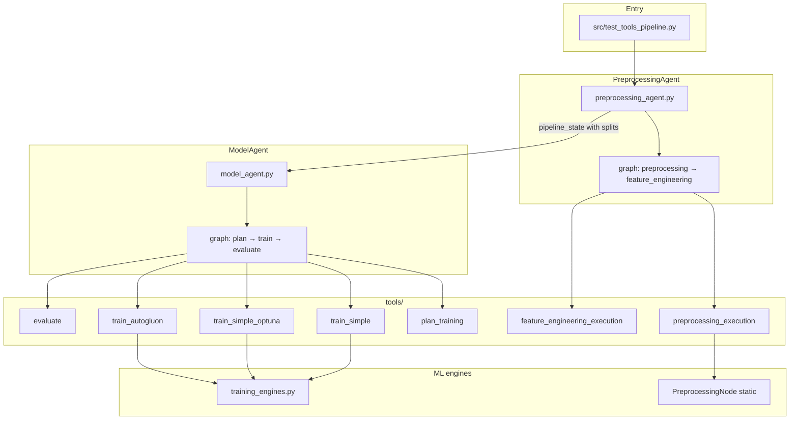
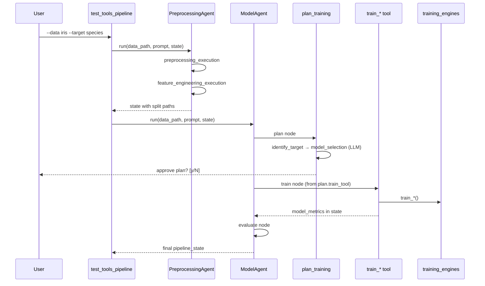

# GP AutoML — Full Pipeline & Model Agent Architecture

This document describes **how the system works today** (as of the PreprocessingAgent + ModelAgent refactor): every layer, agent, tool, node, shared state field, and how data flows from a raw CSV to a trained model.

---

## Table of contents

1. [Big picture](#1-big-picture)
2. [Two different `nodes/` folders](#2-two-different-nodes-folders)
3. [End-to-end pipeline](#3-end-to-end-pipeline)
4. [Shared state: `pipeline_state`](#4-shared-state-pipeline_state)
5. [Phase 1 — PreprocessingAgent](#5-phase-1--preprocessingagent)
6. [Phase 2 — ModelAgent](#6-phase-2--modelagent)
7. [Planning subgraph (inside `plan_training`)](#7-planning-subgraph-inside-plan_training)
8. [Training tools & engines](#8-training-tools--engines)
9. [The three training approaches](#9-the-three-training-approaches)
10. [LLM prompts & whitelists](#10-llm-prompts--whitelists)
11. [Evaluation & metrics](#11-evaluation--metrics)
12. [Alternative orchestration: ControllerAgent](#12-alternative-orchestration-controlleragent)
13. [Entry points & CLI](#13-entry-points--cli)
14. [Disk outputs](#14-disk-outputs)
15. [Environment & dependencies](#15-environment--dependencies)
16. [File reference (every important file)](#16-file-reference-every-important-file)
17. [Who calls whom (quick reference)](#17-who-calls-whom-quick-reference)

---

## 1. Big picture

The pipeline is split into **three layers**:

| Layer                      | Location                          | Responsibility                                                                      |
| -------------------------- | --------------------------------- | ----------------------------------------------------------------------------------- |
| **Agents (orchestration)** | `agents/dynamic/`                 | LangGraph workflows that call tools in order. No ML math here.                      |
| **Tools (execution API)**  | `tools/`                          | LangChain `@tool` functions. Validate state, load data, call engines, update state. |
| **Engines (ML logic)**     | `tools/nodes/training_engines.py` | sklearn, Optuna, AutoGluon, Dask-XGBoost implementations.                           |

**Key design rule:** Agents never train models directly. Every step is a tool invocation with a standard signature:

```python
tool.invoke({
    "task": "...",
    "tool_input": {...},
    "prompt": "...",
    "data_path": "...",
    "llm": llm,
    "state": pipeline_state,
})
# returns (result_dict, updated_pipeline_state)
```



### What changed from the old design

| Old                                                    | Now                                                                                            |
| ------------------------------------------------------ | ---------------------------------------------------------------------------------------------- |
| ModelAgent read raw CSV and split internally           | **PreprocessingAgent** produces `X_train.csv`, `X_test.csv`, `y_train.csv`, `y_test.csv` first |
| `tools/training_data.py` loaded & split data           | **Deleted** — logic merged into `tools/training_common.py`                                     |
| EDA via `data_understanding` before training           | **Optional** — not in default `model_agent` test path                                          |
| `data_cleaning` / `feature_engineering` stubs in tools | Replaced by **PreprocessingAgent** + `feature_engineering_execution`                           |

---

## 2. Two different `nodes/` folders

This confuses people — they are **not** the same thing:

### `agents/dynamic/model_agent/nodes/`

LangGraph **adapter nodes** for the ModelAgent graph. Each node looks up one tool from `ToolRegistry` and calls it.

| File          | Graph node | Tool invoked                                                           |
| ------------- | ---------- | ---------------------------------------------------------------------- |
| `plan.py`     | `plan`     | `plan_training`                                                        |
| `train.py`    | `train`    | `train_simple` / `train_simple_optuna` / `train_autogluon` (from plan) |
| `evaluate.py` | `evaluate` | `evaluate`                                                             |

~50 lines each. **No ML code.**

### `tools/nodes/`

**Business logic nodes** used inside tools (especially the plan subgraph):

| File                  | Used by         | Purpose                                                              |
| --------------------- | --------------- | -------------------------------------------------------------------- |
| `identify_target.py`  | `plan_graph`    | Confirm target column + problem type                                 |
| `model_selection.py`  | `plan_graph`    | **LLM call** — pick approach, models, Optuna space, AutoGluon config |
| `training_engines.py` | `train_*` tools | Actual training implementations                                      |

### `agents/dynamic/preprocessing_agent/nodes/`

Same pattern as ModelAgent — adapters that call preprocessing tools:

| File                     | Tool invoked                    |
| ------------------------ | ------------------------------- |
| `preprocessing.py`       | `preprocessing_execution`       |
| `feature_engineering.py` | `feature_engineering_execution` |

---

## 3. End-to-end pipeline

### Recommended command

```bash
source automl_env_310/bin/activate
python src/test_tools_pipeline.py --mode model_agent --data iris --target species --no-prompts
```

### Step-by-step

| #   | Agent / step              | What happens                                                                                        |
| --- | ------------------------- | --------------------------------------------------------------------------------------------------- |
| 1   | **PreprocessingAgent**    | Runs `preprocessing_execution` → writes splits under `Output/Preprocessing/{dataset}/`              |
| 2   | **PreprocessingAgent**    | Runs `feature_engineering_execution` → optional engineered CSVs (`X_train_engineered.csv`, etc.)    |
| 3   | **ModelAgent → plan**     | `plan_training` tool runs inner graph: identify target → LLM model selection → user approves plan   |
| 4   | **ModelAgent → train**    | One of `train_simple`, `train_simple_optuna`, `train_autogluon` based on `training_plan.train_tool` |
| 5   | **ModelAgent → evaluate** | `evaluate` tool surfaces metrics already computed at train time                                     |



### Skip preprocessing

If splits already exist:

```bash
python src/test_tools_pipeline.py --mode model_agent --data iris --skip-preprocess --no-prompts
```

The test runner loads paths from `Output/Preprocessing/{dataset_stem}/`.

---

## 4. Shared state: `pipeline_state`

Defined in `tools/pipeline_state.py`. Passed through every tool and agent. Tools return `(result, updated_state)`.

### Top-level fields

```python
{
    "data_path": "/path/to/Iris.csv",
    "prompt": "user task string",
    "target_column": "species",
    "problem_type": "classification",       # or "regression"

  # --- Preprocessing outputs ---
    "X_train_path": "Output/Preprocessing/Iris/X_train.csv",
    "X_test_path":  "...",
    "y_train_path": "...",
    "y_test_path":  "...",
    "X_train_engineered_path": "...",       # optional, preferred for training
    "X_test_engineered_path":  "...",
    "preprocessing_output": { ... },        # metadata from preprocessing_execution
    "feature_engineering_output": { ... },

  # --- Planning ---
    "user_preferences": {
        "preferred_models": [],
        "time_preference": "",                # fast | balanced | best
        "hw_complexity": "",
        "ask_before_training": True,
    },
    "training_plan": { ... },                 # see below
    "report": {},                             # optional EDA report if present

  # --- Training results ---
    "model_metrics": { ... },
    "saved_files": { "pickle": "...", "output_dir": "..." },

    "step": "evaluated",                      # current pipeline step
    "status": "success",                        # running | planned | success | error | cancelled
}
```

### `training_plan` (after `plan_training`)

```python
{
    "approach": "simple_optuna",              # simple | simple_optuna | autogluon
    "training_method": "Simple + Optuna HPO",
    "train_tool": "train_simple_optuna",      # ModelAgent train node reads this
    "approved": True,                         # train_* tools refuse if False
    "selected_models": ["RandomForest", "XGBoost"],
    "optuna_config": {                        # only for simple_optuna
        "n_trials": 30,
        "search_space": { "RandomForest": { ... } }
    },
    "automl_config": {                        # only for autogluon
        "models": ["GBM", "XGB"],
        "time_limit": 180,
        "preset": "good_quality"
    },
    "reasoning": "<LLM JSON / text>",
    "n_rows": 150,
    "use_dask_training": False,
}
```

### `model_metrics` (after training)

| Field               | Meaning                                                    |
| ------------------- | ---------------------------------------------------------- |
| `best_model`        | Name of winning model (or AutoGluon leaderboard entry)     |
| `tuning_best_score` | Validation score during tuning / CV                        |
| `test_accuracy`     | Hold-out test accuracy (classification)                    |
| `test_f1_score`     | Weighted F1 on test set                                    |
| `best_score`        | Main reported score (= `test_accuracy` or `test_r2_score`) |
| `confusion_matrix`  | Test set confusion matrix                                  |
| `training_method`   | e.g. `Simple+Defaults`, `AutoGluon`                        |
| `data_source`       | Always `"preprocessed_splits"` now                         |

---

## 5. Phase 1 — PreprocessingAgent

**Location:** `agents/dynamic/preprocessing_agent/`

### Files

| File                           | Role                                                     |
| ------------------------------ | -------------------------------------------------------- |
| `preprocessing_agent.py`       | Public API — `PreprocessingAgent.run(...)`               |
| `graph.py`                     | LangGraph: `preprocessing` → `feature_engineering` → END |
| `state.py`                     | `PreprocessingAgentState` TypedDict                      |
| `tool_runner.py`               | Same invoke helper as ModelAgent                         |
| `nodes/preprocessing.py`       | Adapter → `preprocessing_execution`                      |
| `nodes/feature_engineering.py` | Adapter → `feature_engineering_execution`                |

### Graph routing

After `preprocessing` node:

- If `pipeline_state.status != "success"` or error → **END**
- Else → `feature_engineering`

### `preprocessing_execution` tool

Wraps the static `PreprocessingNode` from `agents/static/preprocessing_agent/preprocessing_node.py`.

**Inputs** (`tool_input`):

- `target_column` — required for supervised learning
- `test_size` (default 0.2)
- `use_llm` (default True) — LLM-driven column policies
- `output_folder` (default `Output/Preprocessing/{dataset_stem}/`)

**Outputs** written to disk:

- `X_train.csv`, `X_test.csv`, `y_train.csv`, `y_test.csv`
- `preprocessing_summary.json` (includes `task_type`)
- `column_actions.json`, `llm_policy.json`, etc.

Updates `pipeline_state` with paths and `preprocessing_output`.

### `feature_engineering_execution` tool

Runs LLM-guided feature engineering on the preprocessed splits. Appends top-K new columns to copies of train/test features.

**Outputs:**

- `X_train_engineered.csv`, `X_test_engineered.csv`
- Feature report JSON

Model training **prefers engineered paths** when they exist (`training_common.resolve_preprocessed_paths`).

---

## 6. Phase 2 — ModelAgent

**Location:** `agents/dynamic/model_agent/`

### Files

| File                | Role                                                                             |
| ------------------- | -------------------------------------------------------------------------------- |
| `model_agent.py`    | `ModelAgent.run()` — builds graph, invokes, returns `pipeline_state`             |
| `graph.py`          | Compiles LangGraph workflow                                                      |
| `state.py`          | `ModelAgentState` — wraps `pipeline_state` + `last_tool`, `last_result`, `error` |
| `tool_runner.py`    | Standard `tool.invoke(...)` wrapper                                              |
| `nodes/plan.py`     | Plan node factory                                                                |
| `nodes/train.py`    | Train node factory                                                               |
| `nodes/evaluate.py` | Evaluate node factory                                                            |

### LangGraph flow

```
START → plan → [approved?] → train → [success?] → evaluate → END
                  ↓ fail              ↓ fail
                 END                 END
```

### Routing conditions (`graph.py`)

| After node | Proceed if                                                                          | Else |
| ---------- | ----------------------------------------------------------------------------------- | ---- |
| `plan`     | `last_result.status == "planned"` AND `training_plan.approved` AND `train_tool` set | END  |
| `train`    | `last_result.status == "success"`                                                   | END  |
| `evaluate` | always                                                                              | END  |

### `ModelAgent.run()` config

Passed into node factories:

| Config key                                      | Effect                                                    |
| ----------------------------------------------- | --------------------------------------------------------- |
| `ask_before_training`                           | Interactive prompts in `plan_training`                    |
| `auto_approve_plan`                             | Skip y/N approval (used with `--no-prompts`)              |
| `training_approach`                             | Force `1`/`2`/`3` or `simple`/`simple_optuna`/`autogluon` |
| `target_column` / `problem_type`                | Override for planning                                     |
| `plan_input` / `train_input` / `evaluate_input` | Extra `tool_input` dicts per step                         |

### Train node logic (`nodes/train.py`)

1. Read `pipeline_state.training_plan.train_tool`
2. Refuse if `approved != True`
3. Look up tool from registry
4. For Optuna: pass `optuna_trials` from config or plan
5. Invoke tool, merge returned state

**The train node does not choose the approach** — that was decided in `plan_training`.

---

## 7. Planning subgraph (inside `plan_training`)

`plan_training` is a LangChain `@tool` that runs its **own** inner LangGraph before the user approves.

### Inner graph (`tools/plan_graph.py`)

```
identify_target → model_selection → END
```

State type: `TrainingGraphState` (`tools/graph_state.py`)

### Node: `identify_target` (`tools/nodes/identify_target.py`)

- Uses `target_column` from preprocessing / user input
- If missing, falls back to **last column** of planning dataframe
- Infers `problem_type`:
  - Numeric target with >20 unique values → `regression`
  - Otherwise → `classification`

### Node: `model_selection` (`tools/nodes/model_selection.py`)

**This is where the main LLM decision happens for training.**

1. Builds a compact **DATA PROFILE** JSON (rows, cols, dtypes, sample rows, target stats)
2. Adds **USER PROMPT** block if preferences / `--prompt` provided
3. Sends **ALLOWED OPTIONS** catalog (whitelisted models, presets, Optuna params)
4. Parses LLM JSON response
5. Sets on graph state:
   - `llm_approach` — `Simple` | `Simple+Optuna` | `AutoGluon`
   - `use_automl` — bool
   - `selected_models` — sklearn model names (filtered to whitelist)
   - `optuna_config` — trials + search space (sanitized)
   - `automl_config` — AutoGluon models, time limit, preset

### After subgraph: `plan_training` builds `training_plan`

1. Maps LLM approach → `(approach, train_tool, training_method)` via `_resolve_approach`
2. Applies user overrides (`time_preference`, `hw_complexity`, `preferred_models`)
3. Prints plan JSON + summary
4. Asks `Continue with this LLM-suggested training plan? [y/N]:` unless `auto_approve_plan`
5. Sets `training_plan.approved = True/False`

**Train tools will not run until `approved == True`.**

---

## 8. Training tools & engines

All three train tools share the same pattern:

1. `ensure_state(state, data_path, prompt)`
2. `require_approved_plan(pipeline_state, expected_approach)`
3. `load_training_context(pipeline_state)` → X_train, X_test, y_train, y_test from CSVs
4. Call engine function
5. `model.predict(X_test)` → `apply_test_metrics`
6. `complete_training` → save `model.pkl`, set `model_metrics`

### Tool files

| File                     | Tool name             | Engine                  | Subfolder for artifact |
| ------------------------ | --------------------- | ----------------------- | ---------------------- |
| `train_simple.py`        | `train_simple`        | `train_simple_defaults` | `training_simple/`     |
| `train_simple_optuna.py` | `train_simple_optuna` | `train_simple_optuna`   | `training_optuna/`     |
| `train_autogluon.py`     | `train_autogluon`     | `train_autogluon`       | `training_autogluon/`  |

### `training_common.py` — shared helpers

| Function                      | Purpose                                        |
| ----------------------------- | ---------------------------------------------- |
| `resolve_preprocessed_paths`  | Pick engineered or base split paths            |
| `require_preprocessed_splits` | Error message if splits missing                |
| `load_preprocessed_splits`    | Read 4 CSVs into DataFrames/Series             |
| `resolve_problem_type`        | From state or `preprocessing_summary.json`     |
| `load_planning_dataframe`     | X_train + target column for plan profiling     |
| `pipeline_to_graph_state`     | Bridge `pipeline_state` → `TrainingGraphState` |
| `load_training_context`       | Bundle everything train tools need             |
| `apply_test_metrics`          | Accuracy/F1 or R²/RMSE on **test** split       |
| `complete_training`           | Save pickle, update state                      |
| `require_approved_plan`       | Gate train tools                               |

**Important:** Training uses the **preprocessed test split** from PreprocessingAgent. Train tools do **not** call `train_test_split` themselves.

### `training_engines.py` — ML implementations

| Function                     | What it does                                                        |
| ---------------------------- | ------------------------------------------------------------------- |
| `train_simple_defaults`      | Loop whitelisted sklearn models, pick best by CV score              |
| `train_simple_optuna`        | Optuna HPO per model using LLM `search_space`; fallback to defaults |
| `train_autogluon`            | `TabularPredictor.fit` with preset + model hyperparameters          |
| `train_dask_xgb`             | Dask + XGBoost for very large data (>700k rows)                     |
| `normalize_autogluon_preset` | Maps legacy preset names to AutoGluon 1.5 names                     |

#### AutoGluon model prefixes (`AUTOGLUON_MODELS`)

| Prefix     | Backend              | Requires                    |
| ---------- | -------------------- | --------------------------- |
| `GBM`      | LightGBM             | `lightgbm`                  |
| `XGB`      | XGBoost              | `xgboost`                   |
| `RF`       | sklearn RandomForest | `scikit-learn`              |
| `CAT`      | CatBoost             | `catboost`                  |
| `XT`       | sklearn ExtraTrees   | `scikit-learn`              |
| `NN_TORCH` | PyTorch neural net   | `torch>=2.6`                |
| `FASTAI`   | FastAI tabular NN    | `autogluon.tabular[fastai]` |

#### AutoGluon presets (LLM whitelist)

Canonical AutoGluon 1.5 names plus legacy aliases the LLM may still emit:

- `medium_quality`, `medium_quality_faster_train`
- `good_quality`, `good_quality_faster_inference` (mapped → `good_quality`)
- `high_quality`, `best_quality`
- `optimize_for_deployment`

`normalize_autogluon_preset()` runs before `TabularPredictor.fit()`.

### `evaluate` tool

Lightweight — metrics are already in `pipeline_state.model_metrics` after training. Sets `step = "evaluated"`.

---

## 9. The three training approaches

The LLM **must** pick exactly one (enforced in `model_selection.py`):

| LLM `approach`  | `training_plan.approach` | Tool                  | Behavior                               |
| --------------- | ------------------------ | --------------------- | -------------------------------------- |
| `Simple`        | `simple`                 | `train_simple`        | sklearn defaults, no HPO               |
| `Simple+Optuna` | `simple_optuna`          | `train_simple_optuna` | sklearn + Optuna with LLM search space |
| `AutoGluon`     | `autogluon`              | `train_autogluon`     | Full AutoGluon AutoML                  |

**Dask-XGBoost** is not an LLM choice. If `n_rows > 700_000`, engines may use Dask automatically (note in plan; large-data path uses preprocessed splits).

### Example LLM output — Simple+Optuna

```json
{
  "approach": "Simple+Optuna",
  "reasoning": "Small tabular set; Optuna can tune tree models quickly.",
  "simple_models": ["RandomForest", "XGBoost"],
  "optuna_settings": {
    "n_trials": 30,
    "search_space": {
      "RandomForest": {
        "n_estimators": { "type": "int", "low": 50, "high": 200 },
        "max_depth": { "type": "int", "low": 3, "high": 15 }
      }
    }
  }
}
```

### Example LLM output — AutoGluon

```json
{
  "approach": "AutoGluon",
  "reasoning": "Mixed feature types; ensemble AutoML likely best.",
  "autogluon_settings": {
    "models_to_prioritize": ["GBM", "XGB", "CAT"],
    "time_limit_seconds": 180,
    "preset_mode": "good_quality"
  }
}
```

---

## 10. LLM prompts & whitelists

### Where prompts live

| Purpose                       | File                                                  | Function / location                                     |
| ----------------------------- | ----------------------------------------------------- | ------------------------------------------------------- |
| Model selection system prompt | `tools/nodes/model_selection.py`                      | `_SYSTEM` constant                                      |
| Model selection human prompt  | `tools/nodes/model_selection.py`                      | `model_selection_node()` — built from profile + catalog |
| ControllerAgent system prompt | `agents/dynamic/controller_agent/controller_agent.py` | `system_prompt` in `run()`                              |
| Default CLI task prompt       | `src/test_tools_pipeline.py`                          | `--prompt` argument default                             |
| Preprocessing LLM policies    | `agents/static/preprocessing_agent/`                  | Inside `PreprocessingNode`                              |

### Whitelists (prevent hallucination)

**sklearn models** (`SKLEARN_MODELS` in `model_selection.py`):

- Classification: `RandomForest`, `GradientBoosting`, `LogisticRegression`, `XGBoost`
- Regression: `RandomForest`, `GradientBoosting`, `LinearRegression`, `XGBoost`

**AutoGluon models:** `GBM`, `XGB`, `RF`, `CAT`, `XT`, `NN_TORCH`, `FASTAI`

**AutoGluon presets:** see section 8

**Optuna param catalog:** documented in `OPTUNA_PARAM_CATALOG` in `model_selection.py`

### Required environment

- `GOOGLE_API_KEY` in `.env` for Gemini
- Optional: `GEMINI_MODEL` (default in test runner: `gemma-4-31b-it`)

---

## 11. Evaluation & metrics

Metrics are computed **during the train tool**, not in a separate evaluation engine:

1. Engine trains on `X_train`, `y_train` (validation inside engine)
2. `model.predict(X_test)` on preprocessed hold-out test split
3. `apply_test_metrics()` adds test-set scores
4. `evaluate` tool reads and returns them

This means `test_accuracy` is always on the **same test split** PreprocessingAgent created — consistent across runs.

---

## 12. Alternative orchestration: ControllerAgent

**Location:** `agents/dynamic/controller_agent/controller_agent.py`

Instead of a fixed LangGraph (plan → train → evaluate), the ControllerAgent runs an **LLM loop**: each turn the LLM picks **one tool** from the registry until `done: true`.

Intended pipeline order (in system prompt):

1. `preprocessing_execution`
2. `feature_engineering_execution`
3. `plan_training`
4. One `train_*` from plan
5. `evaluate`

Same tools, same `pipeline_state` — different orchestration style.

**Entry:** `python src/test_tools_pipeline.py --mode controller` or `src/run_dynamic.py`

---

## 13. Entry points & CLI

### Primary test runner

`src/test_tools_pipeline.py`

| Flag                 | Effect                                             |
| -------------------- | -------------------------------------------------- |
| `--mode model_agent` | PreprocessingAgent → ModelAgent (default)          |
| `--data iris`        | Dataset path or alias                              |
| `--target species`   | Target column for preprocessing                    |
| `--no-prompts`       | Auto-approve plan, skip interactive plan questions |
| `--skip-preprocess`  | Use existing splits in `Output/Preprocessing/`     |
| `--approach 1\|2\|3` | Force Simple / Optuna / AutoGluon                  |
| `--prompt "..."`     | User task string → planning LLM                    |

### Programmatic ModelAgent

```python
from agents.dynamic.model_agent import ModelAgent
from agents.dynamic.preprocessing_agent.preprocessing_agent import PreprocessingAgent

from tools.pipeline_state import empty_state

# Register tools (see build_registry in test_tools_pipeline.py)
registry = build_registry()
llm = make_llm()

state = empty_state(data_path, prompt)
state = PreprocessingAgent(logger, llm, registry).run(
    data_path, prompt, pipeline_state=state, target_column="species"
)
state = ModelAgent(logger, llm, registry).run(
    data_path, prompt, pipeline_state=state, auto_approve_plan=True
)
```

---

## 14. Disk outputs

| Artifact              | Typical path                                                |
| --------------------- | ----------------------------------------------------------- |
| Preprocessed splits   | `Output/Preprocessing/{dataset}/X_train.csv`, etc.          |
| Engineered features   | `Output/Preprocessing/{dataset}/X_train_engineered.csv`     |
| Preprocessing summary | `Output/Preprocessing/{dataset}/preprocessing_summary.json` |
| Trained model         | `output/dynamic_pipeline/{timestamp}/training_*/model.pkl`  |
| AutoGluon runs        | `output/dynamic_pipeline/autogluon/run_{timestamp}/`        |
| Test run final state  | `output/test_pipeline/final_state.json`                     |

---

## 15. Environment & dependencies

Install via `./setup_mac.sh` or `requirements-mac.txt`.

Key packages for the full pipeline:

| Package                                           | Used for                                |
| ------------------------------------------------- | --------------------------------------- |
| `langchain-google-genai`, `langgraph`             | Agents + LLM                            |
| `scikit-learn`, `xgboost`, `lightgbm`, `catboost` | Simple / Optuna / AutoGluon tree models |
| `optuna`                                          | Simple+Optuna path                      |
| `autogluon.tabular[fastai]>=1.5.0`                | AutoGluon path                          |
| `torch>=2.6`                                      | AutoGluon `NN_TORCH`                    |
| `dask`, `dask-ml`                                 | Large-data path                         |

---

## 16. File reference (every important file)

### Agents

```
agents/dynamic/
├── preprocessing_agent/
│   ├── preprocessing_agent.py    # PreprocessingAgent.run()
│   ├── graph.py                    # preprocessing → feature_engineering
│   ├── state.py
│   ├── tool_runner.py
│   └── nodes/
│       ├── preprocessing.py        # → preprocessing_execution
│       └── feature_engineering.py  # → feature_engineering_execution
│
├── model_agent/
│   ├── model_agent.py              # ModelAgent.run()
│   ├── graph.py                    # plan → train → evaluate
│   ├── state.py
│   ├── tool_runner.py
│   └── nodes/
│       ├── plan.py                 # → plan_training
│       ├── train.py                # → train_* from plan
│       └── evaluate.py             # → evaluate
│
└── controller_agent/
    └── controller_agent.py         # LLM tool-picking loop
```

### Tools

```
tools/
├── pipeline_state.py               # empty_state, merge_state
├── registry.py                     # ToolRegistry
├── training_common.py              # splits, metrics, plan bridge
├── plan_training.py                # @tool plan_training
├── plan_graph.py                   # identify_target → model_selection
├── graph_state.py                  # TrainingGraphState
├── preprocessing_execution.py      # @tool — wraps static PreprocessingNode
├── feature_engineering_execution.py
├── train_simple.py
├── train_simple_optuna.py
├── train_autogluon.py
├── evaluate.py
├── data_understanding.py           # optional EDA (not in default path)
└── nodes/
    ├── identify_target.py
    ├── model_selection.py          # LLM model selection
    └── training_engines.py         # sklearn, Optuna, AutoGluon, Dask
```

### Entry points

```
src/
├── test_tools_pipeline.py          # CLI test harness
└── run_dynamic.py                  # ControllerAgent demo
```

### Legacy (not used by new pipeline)

| Path                                 | Notes                                                              |
| ------------------------------------ | ------------------------------------------------------------------ |
| `agents/static/automl_agent/`        | Monolithic AutoMLAgent for OpenML benchmarks                       |
| `agents/static/preprocessing_agent/` | **Used** — `PreprocessingNode` called by `preprocessing_execution` |
| ~~`tools/training_data.py`~~         | **Deleted** — merged into `training_common.py`                     |
| ~~`tools/model_training.py`~~        | **Deleted**                                                        |

---

## 17. Who calls whom (quick reference)

```
test_tools_pipeline.py
│
├─ PreprocessingAgent.run()
│    ├─ preprocessing node → preprocessing_execution.invoke()
│    │                              └─ PreprocessingNode.run()  [static agent]
│    └─ feature_engineering node → feature_engineering_execution.invoke()
│
└─ ModelAgent.run()
     └─ graph.invoke()
          ├─ plan node → plan_training.invoke()
          │                 ├─ pipeline_to_graph_state()
          │                 └─ plan_graph.invoke()
          │                      ├─ identify_target_node
          │                      └─ model_selection_node (LLM)
          │
          ├─ train node → train_{simple|simple_optuna|autogluon}.invoke()
          │                 ├─ load_training_context()  [reads CSV splits]
          │                 └─ training_engines.train_*()
          │
          └─ evaluate node → evaluate.invoke()
```

**Design in one sentence:** PreprocessingAgent prepares and splits the data; ModelAgent plans (with LLM), trains (via tools/engines on those splits), and evaluates — with all shared context living in `pipeline_state`.

---

_See also: [`MODEL_AGENT.md`](./MODEL_AGENT.md) for a shorter overview (some sections may lag this document)._
