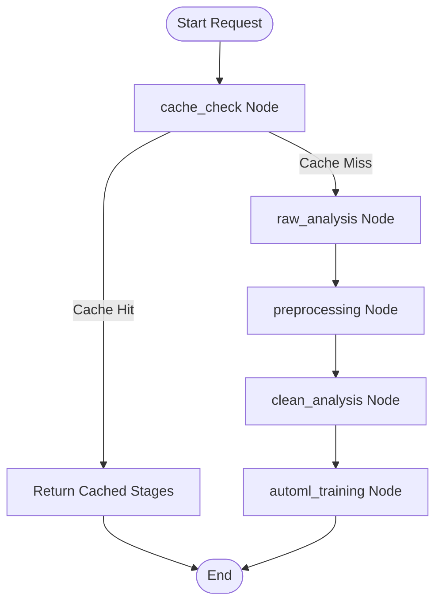
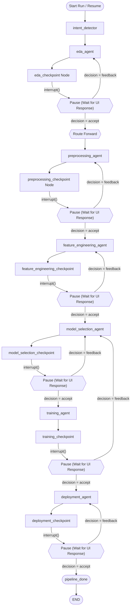
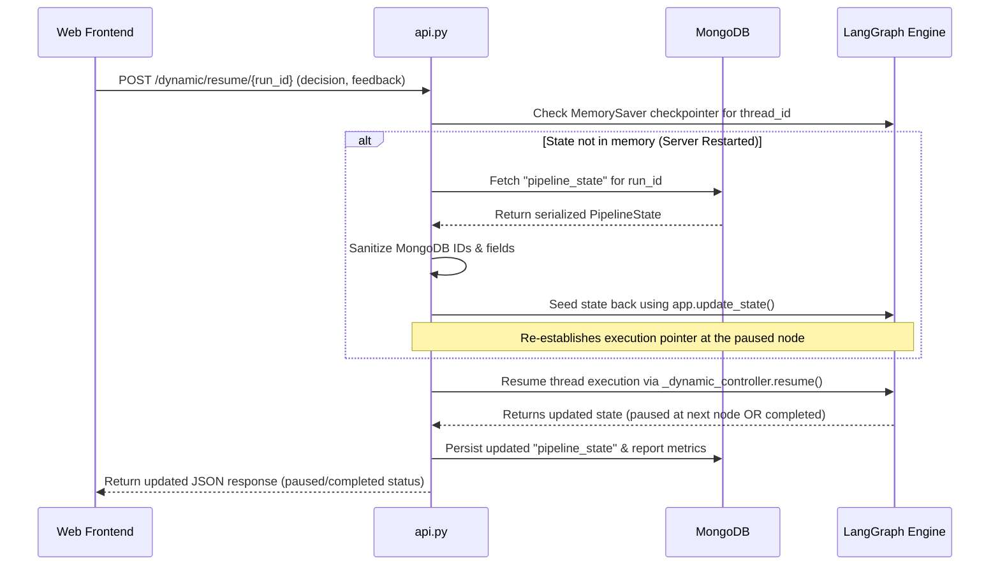

# D.T.D (Data To Deployment) AutoML System Architecture

This document provides a detailed overview of the system architecture of the D.T.D AutoML platform, analyzing how both the static and dynamic pipelines execute, how the orchestration layers function, and how the API handles data flow, caching, and Human-in-the-Loop (HITL) checkpoints.

---

## 1. System Overview & Core Topology

The system is designed with a clear separation of concerns across three layers:
- **API & Orchestration Layer**: Manages the API endpoints, database interactions, session persistence, and pipeline coordination.
- **Agent Orchestration**: Implements state graphs and linear flows that coordinate which analysis, preprocessing, feature engineering, and modeling steps to perform.
- **Tool & Engine Execution**: Implements the actual data operations and machine learning tasks (e.g., scikit-learn, Optuna, AutoGluon, Dask-XGBoost) decoupled from orchestration.

### The Two Pipeline Options
The platform offers two execution paradigms for building and deploying machine learning pipelines:

| Feature | Option 1: Static Pipeline | Option 2: Dynamic Pipeline |
| :--- | :--- | :--- |
| **Orchestrator** | [orchestrator.py](file:///d:/Codes/GP/GP%20code/agents/static/orchestrator.py) | [controller_agent.py](file:///d:/Codes/GP/GP%20code/agents/dynamic/controller_agent/controller_agent.py) |
| **Graph engine** | StateGraph (compiled, linear edges) | StateGraph (compiled, dynamic conditional routing) |
| **Human-in-the-Loop** | None (Fully autonomous sequence) | Interactive (User feedback at agent checkpoints) |
| **Execution Flow** | Pre-defined, sequential stages | Adaptive; driven by Intent Detector and user feedback |
| **Caching Support** | Yes (Content-based caching via hashes) | None (Session-state is interactive) |
| **API Protocol** | SSE (Server-Sent Events) streaming | JSON REST-based Run/Resume cycle |
| **Persistence** | File-based cache on local disk | MongoDB persistence & LangGraph `MemorySaver` |

---

## 2. Option 1: Static Pipeline Architecture

The Static Pipeline is designed for fast, standardized, and repeatable AutoML executions. It follows a strict sequence of stages without interrupting for human guidance.



### Key Components & Lifecycle
1. **Entry Point**: The frontend makes an HTTP POST request to `/run-pipeline/{dataset_id}/{report_id}`.
2. **Streaming Execution**: The backend runs the pipeline in a background thread pool, using an `asyncio.Queue` to bridge the synchronous execution with an asynchronous SSE generator (`StreamingResponse`).
3. **Caching**:
   - The pipeline instantiates `PipelineCacheManager` pointing to `Output/static/cache`.
   - It hashes the raw dataset file bytes and the target column name.
   - If a cached version exists, it streams the saved outputs of all stages immediately.
   - If not, it executes each stage, saves its intermediate outputs to disk, and updates MongoDB.
4. **Processing Stages**:
   - **`raw_analysis`**: Uses static [eda_agent.py](file:///d:/Codes/GP/GP%20code/agents/static/eda_agent/eda_agent.py) to profile the dataset and identify initial problems.
   - **`preprocessing`**: Uses [preprocessing_node.py](file:///d:/Codes/GP/GP%20code/agents/static/preprocessing_agent/preprocessing_node.py) to parse column policies, impute, scale, split into train/test, and reconstruct a clean dataset inside `Output/static/Preprocessing/`.
   - **`clean_analysis`**: Runs static [eda_agent.py](file:///d:/Codes/GP/GP%20code/agents/static/eda_agent/eda_agent.py) on the preprocessed data to output modeling directives.
   - **`automl_training`**: Runs static [automl_agent.py](file:///d:/Codes/GP/GP%20code/agents/static/automl_agent/automl_agent.py) to train classifiers or regressors, outputs metrics, and pickles the winning model.

---

## 3. Option 2: Dynamic Pipeline Architecture

The Dynamic Pipeline utilizes LangGraph's state persistence and `interrupt()` routines to build an interactive, conversational multi-agent workflow. Users review the output of each agent and can either approve it or request edits with custom text feedback.



### Component Flow & Coordination
1. **State Initialization**: [pipeline_state.py](file:///d:/Codes/GP/GP%20code/state/pipeline_state.py) acts as the single source of truth (`PipelineState` TypedDict). It tracks input files, task descriptions, intent flags, execution paths, trained models, metrics, and interactive audit history (`feedback_history`).
2. **Intent Detection & Routing**:
   - The pipeline starts at `intent_detector` (Agent 0).
   - It reads the dataset schema and the user's request.
   - It binds the LLM response to a Pydantic model `IntentFlags` to determine which nodes must run (e.g. `eda: True`, `preprocessing: True`, etc.) and infer the prediction target.
3. **Agent Node Execution & Sub-Graphs**:
   - Each dynamic agent (e.g., [eda_agent.py](file:///d:/Codes/GP/GP%20code/agents/dynamic/eda_agent/eda_agent.py), [preprocessing_agent.py](file:///d:/Codes/GP/GP%20code/agents/dynamic/preprocessing_agent/preprocessing_agent.py)) executes its custom task and populates its result block under `state["agent_outputs"][<agent_name>]`.
   - **Model Evaluation Integration**: The separate evaluation agent has been deprecated and deleted. Instead, model evaluation runs as an internal subnode function (`_run_evaluation_subnode`) inside [training_agent.py](file:///d:/Codes/GP/GP%20code/agents/dynamic/training_agent/training_agent.py) right after model training completes successfully. This step loads the pickled model, scores it on the test splits, saves evaluation plots (Confusion Matrix, ROC Curve, Feature Importance) into `output/dynamic_pipeline/{timestamp}/evaluation/`, writes a `diagnostic_report.json` file, and updates the `PipelineState` metrics and plot paths.
4. **Checkpoint Nodes & Interrupts**:
   - Every active agent is followed by a custom checkpoint node generated by `_make_checkpoint_node(agent_name)` in [graph_builder.py](file:///d:/Codes/GP/GP%20code/graph/graph_builder.py).
   - This checkpoint node invokes LangGraph’s `interrupt({ "agent": agent_name, "agent_output": ... })`.
   - Execution is suspended; control returns back to [api.py](file:///d:/Codes/GP/GP%20code/api.py), which serializes the current state, updates MongoDB, and returns JSON: `{"status": "paused", "run_id": "...", "agent_output": ...}`.
5. **Resuming with Decisions**:
   - The user reviews the output on the web UI and makes a decision.
   - A POST request to `/dynamic/resume/{run_id}` delivers a payload: `decision` ("accept" or "feedback") and `feedback_text`.
   - The graph resumes.
   - If `decision == "feedback"`, the router returns execution to the agent node to re-process with the feedback. (For the `training_agent`, feedback is routed back to `model_selection_agent` to revise the training strategy).
   - If `decision == "accept"`, the router resolves the next flag and executes the subsequent agent.

---

## 4. API Integration Layer (`api.py`)

The REST backend [api.py](file:///d:/Codes/GP/GP%20code/api.py) acts as the controller bridging HTTP routing, MongoDB persistence, and the LangGraph runtime.

### Thread Recovery & Database Synchronization
Because LangGraph's checkpointer (`MemorySaver`) maintains execution states in-memory, thread data is lost if the API server processes recycle or reboot. To prevent this, the backend uses a database-backed recovery mechanism:



### Exposed Endpoints
- **`POST /suggest-target`**: Analyzes uploaded datasets and suggests the target prediction column and problem type.
- **`POST /run-pipeline/{dataset_id}/{report_id}`**: Runs Option 1 (Static Pipeline) in a background executor thread and streams stage updates via server-sent events.
- **`POST /dynamic/run/{report_id}`**: Initializes Option 2 (Dynamic Pipeline). Runs until it hits the first checkpoint, returning the initial preview of the first active agent.
- **`POST /dynamic/resume/{run_id}`**: Validates in-memory thread persistence, restores state from MongoDB if absent, sends the user's approval/feedback command, and advances the dynamic graph.
- **`GET /dynamic/status/{run_id}`**: Polls current state metrics and returns them.

---

## 5. Real-Time Progress Monitoring (`sub_nodes`)

To give users transparency during long-running agent tasks (e.g. dataset cleaning, feature creation, Optuna tuning), each agent defines a nested progress structure called `sub_nodes`.

### Structure
Inside each agent's execution loop, it maintains an array of task items:
```json
"sub_nodes": [
    {
        "name": "Load Data", 
        "description": "Loading target dataset into memory...", 
        "status": "completed"
    },
    {
        "name": "Summary", 
        "description": "Computing overall dataset statistics.", 
        "status": "running"
    },
    {
        "name": "Profiling", 
        "description": "Analyzing column datatypes, values, and completeness.", 
        "status": "pending"
    }
]
```

### Constraints & Rules
- **Naming**: The sub-node names are concise, restricted to a maximum of 1 or 2 words (e.g., "Load Data", "Correlations", "Tuning").
- **States**: Each sub-node transitions through `pending` $\rightarrow$ `running` $\rightarrow$ `completed` or `failed`.
- **Updates**: As the agent progresses internally, it marks the active task as `completed` and the next as `running`. It flushes updates immediately using the helper function `update_agent_progress()`, which updates MongoDB. The web frontend reads this structure to render a granular progress checklist.

---

## 6. Execution Output Folders

To keep the repository directory clean, artifacts are stored in separate, isolated folders:

### Static Pipeline Outputs
All files generated by Option 1 reside in the project root under the `Output/static/` directory:
- **Cache Files**: `Output/static/cache/` contains the content-hashed pipeline states.
- **Preprocessing Splits**: `Output/static/Preprocessing/{dataset_name}/` stores files such as `X_train.csv`, `X_test.csv`, `y_train.csv`, and `y_test.csv`.
- **EDA & Directives**: `Output/static/orchestrator/` stores intermediate reports.
- **Trained Models**: `Output/static/automl/` stores pickled models.

### Dynamic Pipeline Outputs
All files generated by Option 2 are written into dynamically created folders structured by execution timestamp:
- **Artifact Directories**: `output/dynamic_pipeline/{timestamp}/` stores the run's evaluation charts (e.g., SHAP, ROC, Confusion Matrix), engineered feature sheets, and pickled pipelines.
- **AutoGluon Artifacts**: `output/dynamic_pipeline/autogluon/run_{timestamp}/` contains the internal logs and ensemble tables of AutoGluon runs.
